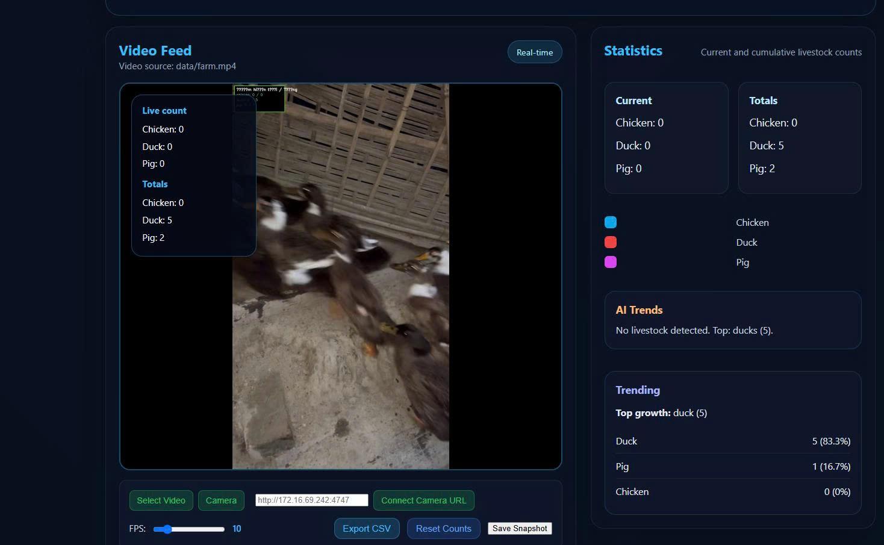
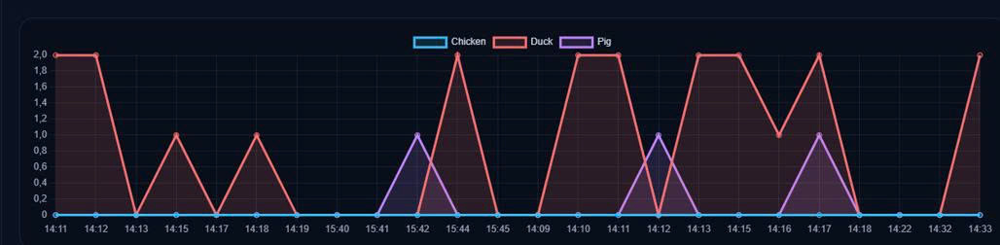
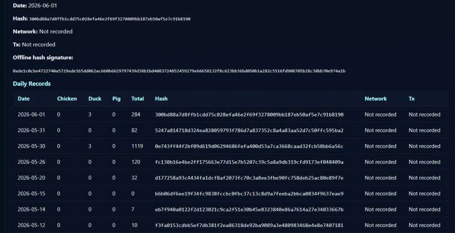

<div align="center">

# 🎓 Faculty of Information Technology (DaiNam University)

---

# XÂY DỰNG HỆ THỐNG GIÁM SÁT SỐ LƯỢNG VẬT NUÔI TRONG TRANG TRẠI

---

<table>
<tr>

<td align="center">
<br><br>
<b>DaiNam</b>
</td>

<td align="center">
<br><br>
<b>AiotLab</b>
</td>

<td align="center">
<br><br>
<b>Khoa Công Nghệ Thông Tin</b>
</td>

</tr>
</table>

<br>


</div>

---

# 📖 1. GIỚI THIỆU ỨNG DỤNG

Hệ thống "Xây dựng hệ thống giám sát số lượng vật nuôi trong trang trại" được phát triển nhằm hỗ trợ người chăn nuôi theo dõi số lượng vật nuôi theo thời gian thực thông qua camera giám sát và công nghệ Trí tuệ nhân tạo (AI).

Dự án sử dụng mô hình YOLOv8n để nhận diện vật nuôi, kết hợp SORT Tracking để theo dõi đối tượng và tránh đếm trùng. Dữ liệu thống kê được lưu trữ trong SQLite và đồng thời tạo mã băm SHA-256 để xác thực tính toàn vẹn trước khi lưu TxHash lên Blockchain Ethereum Sepolia thông qua MetaMask.

## Chức năng chính

* Nhận diện vật nuôi bằng YOLOv8n
* Theo dõi đối tượng bằng SORT Tracking
* Đếm số lượng vật nuôi tự động
* Dashboard thời gian thực
* Lưu lịch sử dữ liệu bằng SQLite
* Tạo mã băm SHA-256
* Kết nối MetaMask
* Lưu TxHash trên Ethereum Sepolia
* Xuất báo cáo CSV
* Thống kê biểu đồ trực quan

---

# 🛠️ 2. CÔNG NGHỆ SỬ DỤNG

| Thành phần           | Công nghệ             |
| -------------------- | --------------------- |
| AI Detection         | YOLOv8n               |
| Object Tracking      | SORT                  |
| Backend              | Flask                 |
| Database             | SQLite                |
| Blockchain           | Ethereum Sepolia      |
| Wallet               | MetaMask              |
| Smart Contract       | Solidity              |
| Hashing              | SHA-256               |
| Frontend             | HTML, CSS, JavaScript |
| Charts               | Chart.js              |
| Programming Language | Python 3.11           |

---

# 📸 3. MỘT SỐ HÌNH ẢNH HỆ THỐNG

## Nhận diện vật nuôi bằng YOLOv8

<p align="center">

</p>

## Thống kê dữ liệu thời gian thực

<p align="center">

</p>

## Kết nối MetaMask

<p align="center">

</p>

## Blockchain Transaction

<p align="center">

</p>

---

# ⚙️ 4. CÁC BƯỚC CÀI ĐẶT

## Bước 1: Clone dự án

```bash
git clone https://github.com/your-account/livestock-monitoring.git
```

```bash
cd livestock-monitoring
```

## Bước 2: Tạo môi trường ảo

```bash
python -m venv .venv
```

Kích hoạt:

```bash
.venv\Scripts\activate
```

## Bước 3: Cài đặt thư viện

```bash
pip install -r requirements.txt
```

Hoặc:

```bash
pip install ultralytics
pip install flask
pip install opencv-python
pip install web3
pip install pandas
```

## Bước 4: Huấn luyện YOLOv8

```bash
yolo detect train data=data.yaml model=yolov8n.pt epochs=100
```

## Bước 5: Chạy Flask

```bash
python app.py
```

## Bước 6: Kết nối MetaMask

* Cài MetaMask Extension
* Chuyển sang Ethereum Sepolia
* Nạp Sepolia ETH từ Faucet
* Import Wallet

## Bước 7: Triển khai Smart Contract

* Truy cập Remix IDE
* Deploy Contract lên Ethereum Sepolia
* Lưu Contract Address

## Bước 8: Truy cập Dashboard

```bash
http://127.0.0.1:5000
```

---

# 📞 5. THÔNG TIN LIÊN HỆ

## 👨‍🎓 Sinh viên thực hiện

Nguyễn Thế Vinh

## 👨‍🏫 Giảng viên hướng dẫn

Th.S Nguyễn Văn Nhân

## 🏫 Đơn vị

Khoa Công nghệ Thông tin

Trường Đại học Đại Nam

## 📧 Email

[vinhvh010204l@gmail.com](mailto:your-email@gmail.com)

## 🌐 GitHub
[https://github.com/your-github](https://github.com/vinhpmo)
---

© 2026 - Faculty of Information Technology - DaiNam University
